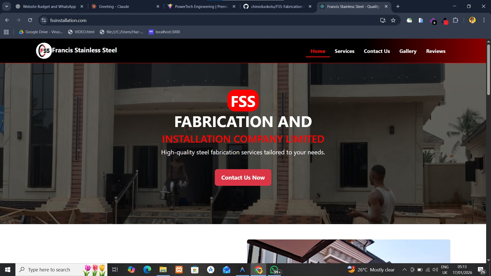

# FSS Fabrication & Installation Website

A modern, responsive business website built for **Francis Stainless Steel (FSS)** — a fabrication and installation company specializing in stainless steel works.  
The website is designed to help clients easily understand services, view completed projects, and contact the business directly.

---

## 🔧 Project Overview

This project is a **professional fabrication company website** created to:
- Showcase fabrication and installation services
- Display completed works in a gallery
- Allow clients to reach the business easily via contact details
- Establish a strong online presence for the company

The UI focuses on **clarity, professionalism, and trust**, matching the standards of premium engineering and fabrication brands.

---

## 🚀 Features

- Responsive navigation bar
- Hero section with strong call-to-action
- Services section for fabrication offerings
- Project gallery showcasing completed works
- Contact page for client enquiries
- Clean and professional layout
- Mobile-friendly design

---

## 🛠️ Technologies Used

- HTML5  
- CSS3  
- JavaScript  
- Responsive Design Principles  

*(Can be upgraded to React or a backend-powered solution if needed.)*

---

## 📄 Pages Included

- Home  
- Services  
- Gallery  
- Contact  
- Reviews  

---

## 🎯 Purpose of the Project

This website was built to help a local fabrication business:
- Attract more clients
- Look professional and trustworthy online
- Provide clear information about services
- Make communication easy and direct

---

## 📸 Screenshot

The image above shows the homepage hero section highlighting the company brand and services.

---

## 🔗 Live Preview

🌐 **Website:** https://fssinstallation.com  

---

## 👨‍💻 Author

**Chinedu Okotu (Chichi)**  
Frontend Developer & Web Designer  
Portfolio: **ChiTech**

---

## 📌 Notes

- This is a client-focused business website.
- Additional features such as online ordering, admin dashboard, or backend integration can be added as future upgrades.

---

## ⭐ Support

If you find this project useful, feel free to star ⭐ the repository.
